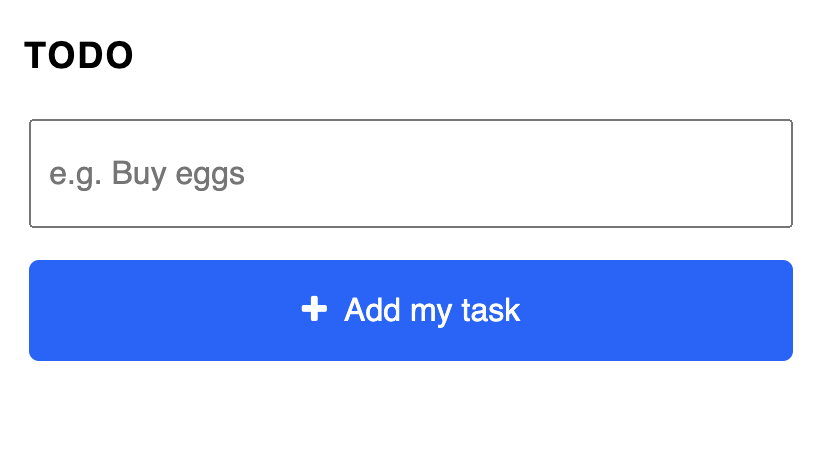
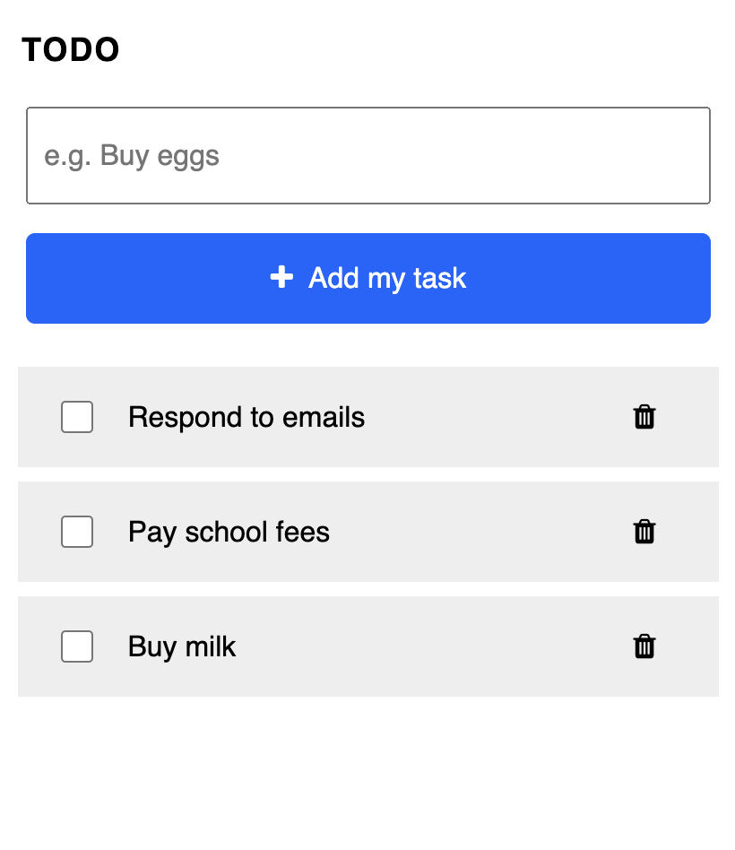
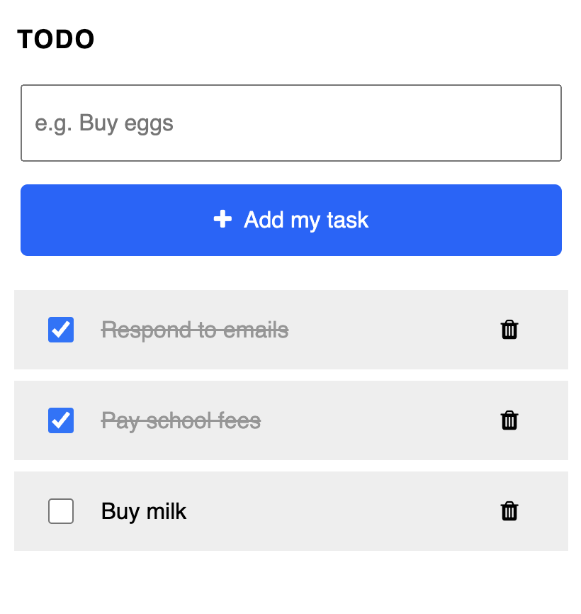

# TODO

A simple task manager. This is a practice project to better understand modules and DOM manipulation in JS.

## Getting started

1. Type a task in the input field and add it to the list by clicking the blue "add my task" button.

2. Once added, task components will be created and displayed beneath each other.

 
3. At completion of a task, the checkbox can be clicked to draw a line through the task item.

4. Tasks can be deleted from the list by clicking on the trash icon.

## Technologies

- HTML
- CSS
- JavaScript
